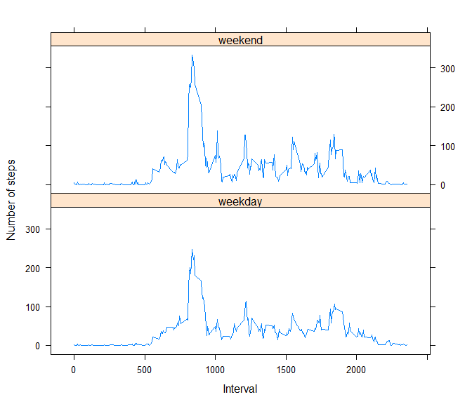

# Reproducible Research: Peer Assessment 1

## Loading and preprocessing the data

The following code loads and preprocesses the data:-


```r
# Create data folder if none exists, and extract activity data
if (!file.exists("./data"))
  dir.create("data")
unzip("activity.zip", exdir = "./data")

# Read the data into memory
activity <- read.csv("./data/activity.csv",
                     header=TRUE,
                     stringsAsFactors = FALSE)

# Convert date values to date format
activity$date <- as.Date(activity$date, "%Y-%m-%d")
```

The variables included in this dataset are:-

- steps: Number of steps taken in a 5-minute interval (missing values are
coded as NA).
- date: Date on which the measurement was taken.
- interval: Identifier for the 5-minute interval in which measurement was taken.
 
**Note on Interval units:** "5" represents 00:05 (i.e. 5 minutes past midnight),
and "10" represents 00:10. Similarly "2355" represents 23:55. For this analysis
the data was not converted to a specific time format as it makes no difference
to the shape of plots.


## What is mean total number of steps taken per day?

To complete this task:-

- Step data grouped by day, and summed (NAs ignored);
- To aid understanding, histogram plotted;
- Mean and median calculated.


```r
# Calculate steps per day, and show histogram
steps_day <- tapply(activity$steps, as.factor(activity$date), sum, na.rm=TRUE)
hist(steps_day, main=("Histogram of Steps/Day"), xlab="No. of steps/day")
```

 


Mean and Median total number of steps taken per day:-

```r
# Mean
mean(steps_day)
```

```
## [1] 9354.23
```

```r
# Median
median(steps_day)
```

```
## [1] 10395
```


## What is the average daily activity pattern?

Time series plot of the 5-minute intervals (x-axis) and the average number of
steps taken, averaged across all days (y-axis).

```r
# Extract all unique time interval values
intervals <- unique(activity$interval)

# Create vector of all interval averages
averages <- numeric(length(intervals))
for (i in 1:length(intervals)){
    all_vals <- activity[which(activity$interval == intervals[i]),][[1]]
    averages[i] <- mean(all_vals, na.rm=TRUE)  
}

# Create df of interval averages
meanIntervals <- data.frame(intervals, averages)
names(meanIntervals) <- c("interval", "mean_steps")
rm(averages, all_vals) # Clear memory

# Plot line graph
with(meanIntervals, plot(interval, mean_steps, type="l",
     xlab="Daily 5 minute intervals",
     ylab="Average no. Steps"))
```

 

Which 5-minute interval, on average across all the days in the dataset, contains
the maximum number of steps?

```r
# Max index location, and resultant max
max_ind <- with(meanIntervals,
                which(mean_steps == max(mean_steps)))
meanIntervals$interval[max_ind]
```

```
## [1] 835
```
**Note a value of "835" signifies 8:35am**


## Imputing missing values

#### 1. Total number of missing values in the dataset (number of rows)
Variables
- "na_rows" - a logical variable; True if row includes an NA.

```r
# Total number of rows with NAs
na_rows <- !complete.cases(activity)
length(which(na_rows == TRUE))
```

```
## [1] 2304
```

#### 2. Strategy to deal with NAs.
**Strategy Chosen:** If value found to be NA, replace with average for that
particular 5-minute interval.

#### 3. Create a new activity dataset and impute missing values.


```r
# Copy activity dataframe and insert imputed values
class(activity)
```

```
## [1] "data.frame"
```

```r
activity_processed <- activity
for (i in 1:nrow(activity)){
    if (na_rows[i] == TRUE){
        interval_value <- activity$interval[i]
        index <- which(meanIntervals$interval == interval_value)
        activity_processed$steps[i] <- meanIntervals$mean_steps[index]
    }
}
rm(index, interval_value)
```

#### 4. Histogram

```r
# Calculate revised steps per day, and resulting histogram
steps_day_processed <- tapply(activity_processed$steps,
                              as.factor(activity_processed$date),
                              sum, na.rm=TRUE)
hist(steps_day_processed,
     main=("Histogram of Steps/Day"),
     xlab="No. of steps/day")
```

 


Mean and Median total number of steps taken per day:-

```r
# Mean
mean(steps_day_processed)
```

```
## [1] 10766.19
```

```r
# Median
median(steps_day_processed)
```

```
## [1] 10766.19
```

Do these values differ from the estimates from the first part of the assignment? 
*- Yes they do.*

What is the impact of imputing missing data on the estimates of the total daily
number of steps?
*- The mean and median figures have been increased. It is noted tha the mean*
*and median are the same which indicates that the data is evenly distributed*
*about the mean*


## Are there differences in activity patterns between weekdays and weekends?

#### 1. Create a new factor variable
The new variable has two levels – “weekday” and “weekend” indicating whether a
given date is a weekday or weekend day.

```r
# Create vector of weekday/weekend and add column to data.frame
weekday <- character(length=nrow(activity_processed))
for (i in 1:nrow(activity_processed)){
    if (weekdays(activity_processed$date[i]) %in% c('Saturday','Sunday')){
        weekday[i] <- "weekend"
    }
    else{
        weekday[i] <- "weekday"
    }
}
weekday <- as.factor(weekday)
activity_processed$weekday <- weekday
rm(weekday) # Clear memory
```

#### 2. Make a panel plot
The plot contains a time series plot (i.e. type = "l") of the
5-minute interval (x-axis) and the average number of steps taken, averaged
across all weekday days or weekend days (y-axis).

```r
# Need to subset activity_processed based on weekday factor
activity_weekday <- activity_processed[activity_processed$weekday == "weekday", 1:3]
activity_weekend <- activity_processed[activity_processed$weekday == "weekend", 1:3]

# Create vector of all interval averages for both weekends and weekdays
ave_weekend <- numeric(length(intervals))
ave_weekday <- numeric(length(intervals))
for (i in 1:length(intervals)){
    all_vals_wend <- activity_processed[which(activity_weekend$interval == intervals[i]),][[1]]
    ave_weekend[i] <- mean(all_vals_wend, na.rm=TRUE)  
    all_vals_wday <- activity_processed[which(activity_weekday$interval == intervals[i]),][[1]]
    ave_weekday[i] <- mean(all_vals_wday, na.rm=TRUE)  
}

# Create df of interval averages, and clear vectors no longer required. 
meanIntervalsDays <- data.frame(intervals, ave_weekday, ave_weekend)
names(meanIntervalsDays) <- c("interval", "weekday", "weekend")
rm(ave_weekend, ave_weekday)

# Reshapd df for use with lattice plotting package.
library(reshape)
dataPlot <- melt(meanIntervalsDays, id="interval")

# Plot data using lattice package.
library(lattice)
with(dataPlot,
     xyplot(value ~ interval |
            variable,
            layout = c(1,2),
            type = "l",
            xlab = "Interval",
            ylab = "Number of steps")
)
```

 
